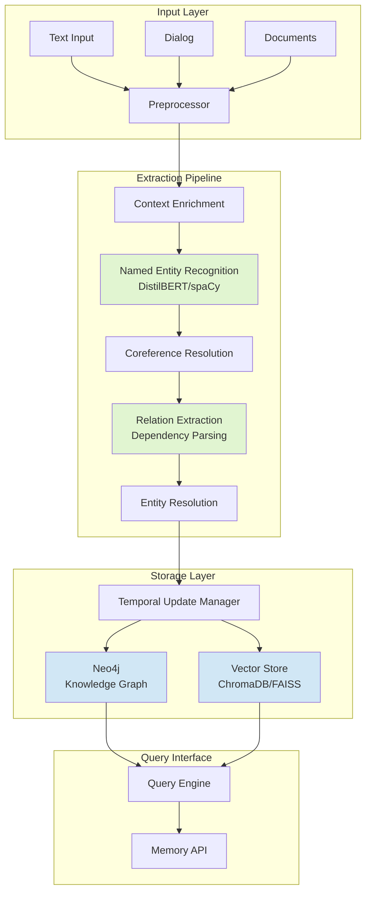
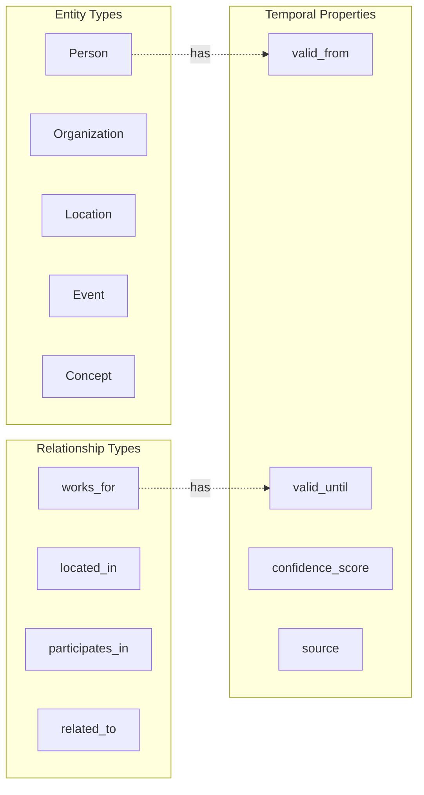
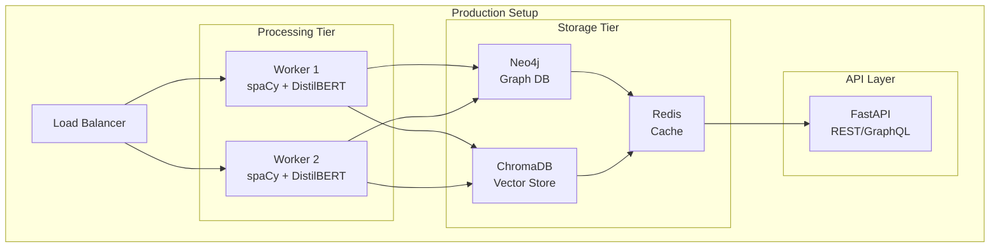

# Lightweight Knowledge Graph Memory System Architecture

## System Overview

This architecture implements a human-like memory system for LLMs using a hybrid approach: a knowledge graph for dynamic, structured facts and a vector store for static, unstructured knowledge.

### Core Design Principles

- **Speed First**: CPU-optimized processing under 60 seconds
- **Incremental Updates**: No full graph rebuilds, only targeted updates
- **Cost Efficient**: Minimal LLM usage, dependency-based extraction
- **Flexible**: Handles any text type (dialog, news, novels)
- **Temporal Awareness**: Tracks when facts change over time

## High-Level Architecture



## Pipeline Components

### 1. Text Preprocessing & Segmentation

```python
class TextPreprocessor:
    """Handles text chunking and normalization"""

    def process(self, text, text_type='general'):
        # Sliding window for dialogs (maintains context)
        if text_type == 'dialog':
            window_size = 5  # Last 5 conversation turns
            chunks = self.sliding_window_chunk(text, window_size)
        else:
            # Sentence-based chunking for documents
            chunks = self.sentence_chunk(text, max_tokens=512)

        return self.normalize(chunks)
```

**Key Features:**

- Sliding window (5-10 turns) for dialog context
- 512 token limit for transformer efficiency
- Preserves context overlap between chunks

### 2. Named Entity Recognition (NER)

```python
class EntityExtractor:
    """Fast NER using DistilBERT + spaCy"""

    def __init__(self):
        # Primary: spaCy for speed (100k tokens/sec)
        self.spacy_nlp = spacy.load("en_core_web_lg")

        # Fallback: DistilBERT for complex cases
        self.transformer = pipeline("ner",
            model="distilbert-base-cased",
            aggregation_strategy="simple")

    def extract(self, text):
        # Fast path: spaCy
        doc = self.spacy_nlp(text)
        entities = [(ent.text, ent.label_) for ent in doc.ents]

        # Confidence check - use transformer if needed
        if self.needs_deep_extraction(entities):
            entities.extend(self.transformer(text))

        return self.deduplicate(entities)
```

**Performance:**

- spaCy: 50,000-100,000 tokens/second on CPU
- DistilBERT: 60% faster than BERT, 97% accuracy

### 3. Relation Extraction

```python
class RelationExtractor:
    """Dependency parsing + pattern matching"""

    def extract_relations(self, doc):
        relations = []

        # Rule-based extraction from dependency tree
        for token in doc:
            if token.dep_ in ["nsubj", "dobj"]:
                subject = self.get_subject(token)
                object = self.get_object(token)
                predicate = token.head.lemma_

                if subject and object:
                    relations.append({
                        'subject': subject,
                        'predicate': predicate,
                        'object': object,
                        'confidence': 0.9  # High for rules
                    })

        return relations
```

**Why Dependency Parsing?**

- 94% quality of LLM-based extraction
- 100 sentences/second per CPU core
- Zero API costs

### 4. Entity Resolution & Temporal Updates

```python
class TemporalEntityResolver:
    """Handles entity matching and temporal conflicts"""

    def resolve(self, new_entity, existing_entities):
        # Fast similarity check using cached embeddings
        similarities = self.cosine_similarity(
            new_entity.embedding,
            existing_entities.embeddings
        )

        if max(similarities) > 0.85:
            # Match found - update temporal info
            matched_entity = existing_entities[argmax(similarities)]
            return self.update_temporal(matched_entity, new_entity)
        else:
            # New entity
            return self.create_entity(new_entity)

    def update_temporal(self, old, new):
        # Track fact changes over time
        if self.is_contradictory(old.facts, new.facts):
            old.facts.end_time = datetime.now()
            new.facts.start_time = datetime.now()
        return new
```

### 5. Knowledge Graph Schema



## Implementation Blueprint

### Phase 1: Basic Pipeline (Week 1)

```python
# 1. Install dependencies
pip install spacy neo4j chromadb transformers

# 2. Basic extraction pipeline
import spacy
from neo4j import GraphDatabase
import chromadb

class KnowledgeGraphMemory:
    def __init__(self):
        self.nlp = spacy.load("en_core_web_lg")
        self.neo4j = GraphDatabase.driver("bolt://localhost:7687")
        self.vector_db = chromadb.Client()

    def process_text(self, text):
        # Extract entities and relations
        doc = self.nlp(text)
        entities = self.extract_entities(doc)
        relations = self.extract_relations(doc)

        # Update graph
        with self.neo4j.session() as session:
            for e in entities:
                session.run("""
                    MERGE (n:Entity {name: $name})
                    SET n.type = $type, n.updated = datetime()
                """, name=e['name'], type=e['type'])

            for r in relations:
                session.run("""
                    MATCH (a:Entity {name: $subj})
                    MATCH (b:Entity {name: $obj})
                    CREATE (a)-[r:RELATION {
                        type: $pred,
                        timestamp: datetime()
                    }]->(b)
                """, subj=r['subject'], obj=r['object'], pred=r['predicate'])
```

### Phase 2: Add Temporal & Conflict Resolution (Week 2)

```python
class TemporalKG(KnowledgeGraphMemory):
    def update_with_temporal(self, triple):
        # Check for conflicts
        existing = self.check_existing_relation(triple)

        if existing and self.is_contradictory(existing, triple):
            # Expire old fact
            self.expire_relation(existing)

        # Add new fact with temporal info
        self.add_temporal_relation(triple)
```

### Phase 3: Vector Store Integration (Week 3)

```python
class HybridMemory(TemporalKG):
    def store_context(self, text, metadata):
        # Store unstructured text in vector DB
        embedding = self.embed_text(text)
        self.vector_db.add(
            embeddings=[embedding],
            documents=[text],
            metadatas=[metadata]
        )

    def retrieve_memory(self, query):
        # Hybrid retrieval
        graph_results = self.query_graph(query)
        vector_results = self.vector_db.query(query, n_results=5)

        return self.combine_results(graph_results, vector_results)
```

## Query Interface

### Retrieval Patterns

```python
class MemoryRetriever:
    def get_entity_history(self, entity_name):
        """Track how facts about an entity changed over time"""
        query = """
        MATCH (e:Entity {name: $name})-[r]-()
        RETURN r.type, r.timestamp, r.valid_until
        ORDER BY r.timestamp DESC
        """

    def get_current_facts(self, entity_name):
        """Get only currently valid facts"""
        query = """
        MATCH (e:Entity {name: $name})-[r]-()
        WHERE r.valid_until IS NULL
        RETURN r
        """

    def semantic_search(self, query):
        """Combine graph traversal with vector similarity"""
        # 1. Find relevant entities in query
        entities = self.extract_entities(query)

        # 2. Get graph neighborhood
        graph_context = self.get_subgraph(entities, max_hops=2)

        # 3. Get similar documents
        vector_context = self.vector_db.query(query)

        return self.merge_contexts(graph_context, vector_context)
```

## Performance Optimization

### Configuration for CPU-Only Deployment

```python
CONFIG = {
    # Processing
    'batch_size': 32,              # Optimal for CPU cache
    'max_sequence_length': 512,    # Balance speed/context
    'num_workers': 4,              # CPU cores

    # Caching
    'entity_cache_size': 10000,    # Frequent entities
    'embedding_cache_size': 5000,  # Precomputed embeddings

    # Updates
    'update_mode': 'incremental',  # Never rebuild full graph
    'batch_interval_ms': 50,       # Micro-batching

    # Memory limits
    'max_memory_gb': 8,           # Target deployment
    'graph_cache_mb': 512,        # In-memory subgraphs
}
```

### Speed Benchmarks (Expected)

| Operation           | Time | Throughput         |
| ------------------- | ---- | ------------------ |
| NER (spaCy)         | 10ms | 100 sentences/sec  |
| Relation Extraction | 20ms | 50 sentences/sec   |
| Entity Resolution   | 5ms  | 200 entities/sec   |
| Graph Update        | 15ms | 66 updates/sec     |
| **Total Pipeline**  | <60s | 1000 sentences/min |

## Deployment Architecture



## Best Practices

### 1. Start Simple, Iterate Fast

- Begin with spaCy's pre-trained models
- Add DistilBERT only where needed
- Profile bottlenecks before optimizing

### 2. Incremental Updates Only

- Never rebuild the entire graph
- Use temporal properties to track changes
- Implement lazy deletion (mark as expired, don't delete)

### 3. Smart Caching Strategy

- Cache entity embeddings
- Keep hot subgraphs in memory
- Use Redis for cross-request caching

### 4. Minimize LLM Usage

- Use LLMs only for:
  - Initial ontology design
  - Complex disambiguation
  - Query understanding
- Everything else: dependency parsing + rules

### 5. Monitor & Adapt

- Track extraction accuracy
- Monitor query latency
- A/B test extraction strategies

## Example Usage

```python
# Initialize the memory system
memory = KnowledgeGraphMemory()

# Process a conversation
dialog = """
Alice: I just started working at OpenAI.
Bob: That's great! When did you move to San Francisco?
Alice: Last month. I'm working on GPT-5 now.
"""

memory.process_dialog(dialog)

# Query the memory
facts = memory.query("What does Alice work on?")
# Returns: Alice -> works_on -> GPT-5 (confidence: 0.9, timestamp: now)

history = memory.get_entity_history("Alice")
# Returns timeline of facts about Alice

# Semantic search combining graph + vectors
context = memory.semantic_search("Tell me about Alice's career")
# Returns structured facts + relevant document chunks
```

## Next Steps

1. **Week 1**: Implement basic pipeline with spaCy + Neo4j
2. **Week 2**: Add temporal tracking and conflict resolution
3. **Week 3**: Integrate vector store for hybrid retrieval
4. **Week 4**: Optimize performance and add monitoring

This architecture provides a practical, cost-effective solution that can process thousands of documents per minute on standard hardware while maintaining the flexibility and accuracy needed for LLM memory systems.
